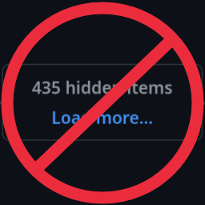

# No more "Load more" buttons on github

Annoyed that `^F` does not work in long github discussions?
Tired from clicking "Load more" over and over again?
This extension is for you!

# Development

NB: I have no idea how to make extensions. You might know better than me. 

[`web-ext`](https://github.com/mozilla/web-ext) is pretty cool for running the extension.

The code as-written is pretty hacky, but it does work.

For testing see [this issue](https://github.com/rust-lang/rust/issues/35121#issuecomment-243008208) ("Load more") or this [pull request](https://github.com/rust-lang/rust/pull/111503/files#diff-b12d31237d3790cfe414f072d2ac7ed12906ccbc95f01b7454c72ebab5001421) ("Load diff"). For debugging on android see [this page](https://extensionworkshop.com/documentation/develop/developing-extensions-for-firefox-for-android/). For instructions on how to publish extensions see [this](https://extensionworkshop.com/documentation/publish/submitting-an-add-on/).
